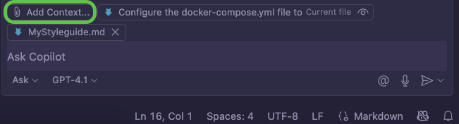

# Custom writing instructions for GitHub Copilot

For the past couple of months I've been using VS Code as my documentation writing tool. I've enjoyed it for many different reasons, not only the amazing custom themes.
Since I also have GitHub Copilot license, I've decided to put it into use when writing documentation. I find it super useful for ensuring the html syntax is correct.
<!--truncate-->

The most recent feature I tested is the custom instructions. The custom instructions is a file that you reference when writing a prompt and ensuring the GitHub Copilot has precise instructions. In my use case I created a simple markdown file containing rules mostly based on *Microsoft Style Guide*.

I would then write my documentation  article in VS Code, initiate the GitHub Copilot agent and write a simple prompt:

- *Review this file and ensure it follows the style guide from the file MyStyleguide.md.*

The key part is to add the style guide file to the context of your prompt so that Copilot can pick it up and use it.

## Custom instructions file

The custom instructions file I created is a markdown file based on *Microsoft Style Guide*, best practices in technical writing and  some custom rules. Your custom rules are the best part of the file, because you ensure that Copilot follows what is important in your organization.
You can add a table of UI elements used in your product, and ensure they are always written using bold characters  or wrapped in a particular html tag. Ensure the custom instructions  file is written in an AI friendly manner. Readable tables, simple commands such as "Use active voice", tables containing "Use" and "Don't use" columns, determine the tone and how you address the reader... 

## Use cases

Technical authors relying on their internal style guide are well familiar with it, and chances are they apply most (if not all) rules immediately. However, in cases where you:
- receive initial content from another author (a wiki page written by an SME, customer support team docs, internal docs...)
- perform a peer review
- onboard a new coleague
- rewrite old technical documentation
  
the custom instructions file can ensure the Copilot generated output follows your style guide.
The style guide is like sourdough bread starter. You need to feed it from time to time (by adding more rules and examples and removing those no longer necessary) and it is best when you share it with others.

As with any other AI related use case, ensure that the final review is conducted by a carbon based human who runs on coffee and chocolate.